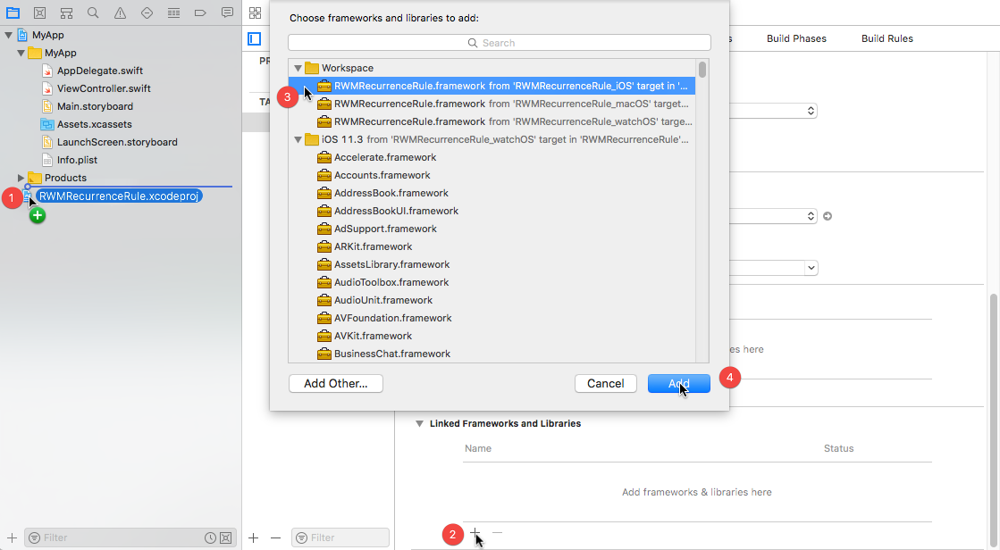

# RWMRecurenceRule

Provides support for iCalendar RRULE expressions including an extension to [EventKit][] allowing you to create an [EKRecurrenceRule][] from an RRULE expression and to enumerate the dates of an [EKEvent][].

For complete details about iCalendar RRULE expressions, see the [Format Definition][] and [examples][] at [iCalendar.org][].

Note that you do not need to make any use of RRULE expressions to use this framework. If you just want to enumerate
the dates of an EKEvent, you can this framework to do so without any use or knowledge of RRULE syntax.

RWMRecurrenceRule can be used with iOS 9.0 and later, macOS 10.12 and later, and watchOS 2.0 and later.

[Format Definition]: https://icalendar.org/iCalendar-RFC-5545/3-3-10-recurrence-rule.html
[examples]: https://icalendar.org/iCalendar-RFC-5545/3-8-5-3-recurrence-rule.html
[iCalendar.org]: https://icalendar.org/

## Usage

```swift
import EventKit
import RWMRecurrenceRule

// TODO - more coming soon
```

Feel free to experiment from Xcode using the project's playground.

## Installation

> _Note_: RWMRecurrenceRule requires Swift 4.1 and Xcode 9.3.

### CocoaPods

[CocoaPods][] is a dependency manager for Cocoa projects. To install RWMRecurrenceRule with CocoaPods:

 1. Make sure CocoaPods is [installed][CocoaPods Installation]. (RWMRecurrenceRule
    requires version 1.0.0 or greater.)

    ```sh
    # Using the default Ruby install will require you to use sudo when
    # installing and updating gems.
    [sudo] gem install cocoapods
    ```

 2. Update your Podfile to include the following:

    ```ruby
    use_frameworks!

    target 'YourAppTargetName' do
        pod 'RWMRecurrenceRule', '~> 0.0.1'
    end
    ```

 3. Run `pod install --repo-update`.

[CocoaPods]: https://cocoapods.org
[CocoaPods Installation]: https://guides.cocoapods.org/using/getting-started.html#getting-started

### Swift Package Manager

The [Swift Package Manager][] is a tool for managing the distribution of
Swift code.

1. Add the following to your `Package.swift` file:

  ```swift
  dependencies: [
      .package(url: "https://github.com/rmaddy/RWMRecurrenceRule.git", from: "0.0.1")
  ]
  ```

2. Build your project:

  ```sh
  $ swift build
  ```

[Swift Package Manager]: https://swift.org/package-manager

### Manual

To install RWNRecurrenceRule as an Xcode sub-project:

 1. Drag the **RWMRecurrenceRule.xcodeproj** file into your own project.
    ([Submodule][], clone, or [download][] the project first.)

    

 2. In your target’s **General** tab, click the **+** button under **Linked
    Frameworks and Libraries**.

 3. Select the appropriate **RWMRecurrenceRule.framework** for your platform.

 4. **Add**.

Some additional steps are required to install the application on an actual
device:

 5. In the **General** tab, click the **+** button under **Embedded
    Binaries**.

 6. Select the appropriate **RWMRecurrenceRule.framework** for your platform.

 7. **Add**.


[Xcode]: https://developer.apple.com/xcode/downloads/
[Submodule]: http://git-scm.com/book/en/Git-Tools-Submodules
[download]: https://github.com/rmaddy/RWMRecurrenceRule/archive/master.zip

## Issues

If you find any issues with RWMRecurrenceRule, please [open an issue][]

[open an issue]: https://github.com/rmaddy/RWMRecurrenceRule/issues/new

## License

RWMRecurrenceRule is available under the MIT license. See [the LICENSE
file](./LICENSE.txt) for more information.

[EventKit]: https://developer.apple.com/documentation/eventkit
[EKRecurrenceRule]: https://developer.apple.com/documentation/eventkit/ekrecurrencerule
[EKEvent]: https://developer.apple.com/documentation/eventkit/ekevent
